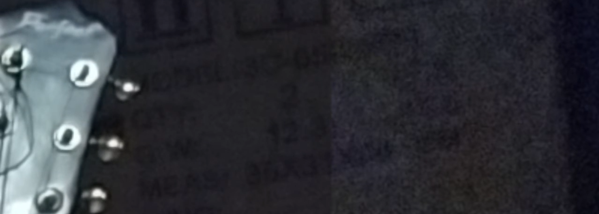
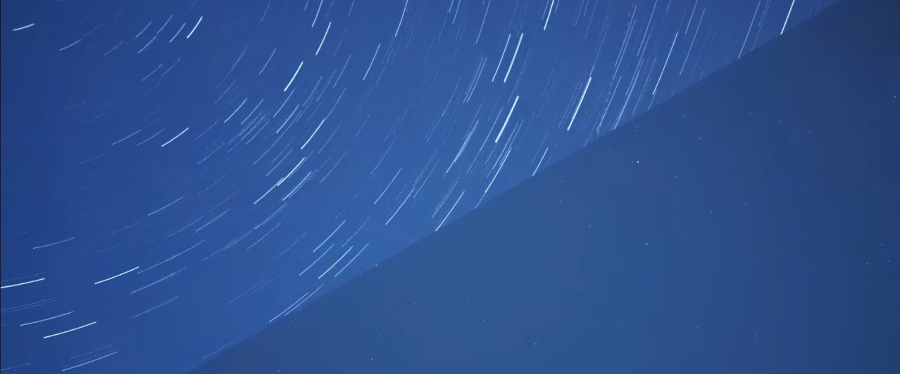
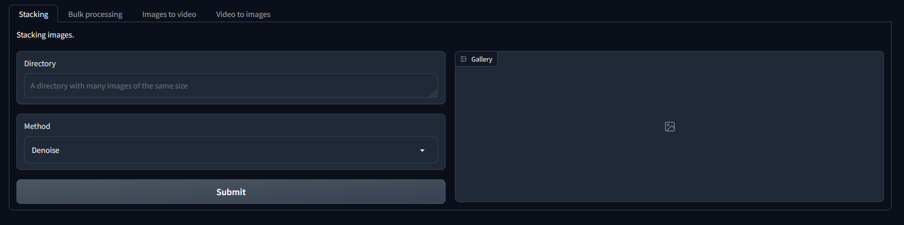

# Image-Pluser WebUI Application

Image-Pluser is a web user interface (WebUI) application built on top of Gradio that allows users to stack photos using different methods. The application provides a simple and intuitive interface for users to upload multiple images and combine them in various ways.

## Getting Started

To run Image-Pluser, follow these steps:

1. Clone the repository: `git clone https://github.com/artegoser/image-pluser-webui.git`
2. Create venv: `python -m venv venv`
3. Install the necessary dependencies: `pip install -r requirements.txt`
4. Run the application: `python app.py`
5. Access the application by visiting http://localhost:7860/ in your web browser.

### one-click-installers

Just download and run the file in `scripts/one-click` (you need git and python3).

# Available Methods

1. Denoising: Removes noise from the image (pictures should not move)
2. StarTracks: Creates star tracks (the pictures should show the sky, which gradually moves)
3. Noise extractor: Gets all the noise in the image (actually makes nonsense)
4. Untrack: Removes stars from the sky (pictures are the same as in StarTracks)

# Examples

Denoise

StarTracks

Ui

# Contributing

Contributions to Image-Pluser are welcome! If you would like to contribute, please fork the repository and submit a pull request.

# License

This project is licensed under the MIT License. See the `LICENSE` file for details.
