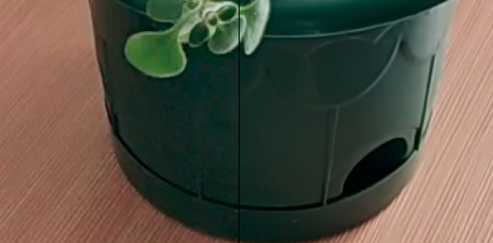

# Image-Pluser WebUI Application

Image-Pluser is a Web User Interface (WebUI) application that allows users to process photos and videos in a variety of ways.

## Getting Started

To run Image-Pluser, follow these steps:

1. Clone the repository: `git clone https://github.com/artegoser/image-pluser-webui.git`
2. Create venv: `python -m venv venv`
3. Install the necessary dependencies: `pip install -r requirements.txt`
4. Run the application: `python app.py`
5. Access the application by visiting <http://localhost:7860/> in your web browser.

### one-click-installers

Just download and run the file in `scripts/one-click` (you need git and python3).

## Available Stacking Methods

1. Denoising: Removes noise from the image (pictures should not move)
2. StarTracks: Creates star tracks (the pictures should show the sky, which gradually moves)
3. Untrack: Removes stars from the sky (pictures should not move)
4. Noise extractor: Gets all the noise in the image (actually makes nonsense)

## Examples

Denoise

StarTracks

Ui

## Contributing

Contributions to Image-Pluser are welcome! If you would like to contribute, please fork the repository and submit a pull request.

## License

This project is licensed under the MIT License. See the `LICENSE` file for details.
